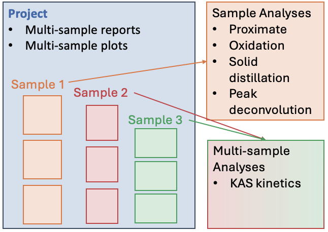

.. tga_data_analysis documentation master file, created by
   sphinx-quickstart on Mon Apr  1 21:47:38 2024.
   You can adapt this file completely to your liking, but it should at least
   contain the root `toctree` directive.

Automating TGA Data Analysis
============================

The `tga_data_analysis` tool automates the typical analysis of thermogravimetric analysis (TGA) data, saving time and avoiding human error. 

Framework
---------

Project
^^^^^^^

The ``Project`` class refers to a folder that containes all TGA data for a project and to a set of project-level parameters (example temperature unit and plot style). 

TGA data are stored as ``Samples``. 

The ``Project`` class can generate publication quality **multi-sample reports** and **multi-sample plots**.

Sample
^^^^^^

A collection of replicate runs (TGA files) of the same test, specified by their filenames.

The ``Sample`` class provides direct access to single replicate results and to their average and standard deviation. 

The ``Measure`` class is used to store each numerical value, so that single replicate, average, and standard deviation are available for each intermediate step and final result.

The ``Sample`` class can generate **multi-replicate reports** and **multi-replicate plots** for data inspection.

:doc:`Getting started <example_intro_tga_data_analysis>`

:doc:`Multi-sample report example <example_reports>`

Single-sample Analyses
^^^^^^^^^^^^^^^^^^^^^^

The ``Sample`` class provides method to perform common TGA data analysis at the sample level, providing statistics based on the replicates.

Proximate Analysis
"""""""""""""""""""
Determines the moisture, volatile matter, and ash content from TGA data.

:doc:`Code example <example_proximate_analysis>`

Oxidation Analysis
""""""""""""""""""
Analyzes the oxidation behavior of materials.

:doc:`Code example <example_oxidation_analysis>`

Solid-Distillation Analysis
""""""""""""""""""""""""""""
Studies the thermal decomposition and distillation characteristics of solids.

:doc:`Code example <example_soliddistillation>`

Peak Deconvolution Analysis
""""""""""""""""""""""""""""
Resolves overlapping thermal decomposition events.

:doc:`Code example <example_deconvolution>`

Multi-sample Analyses
^^^^^^^^^^^^^^^^^^^^^
For analysis that require data from multiple samples (ex. KAS kinetics), a multi-sample class that includes multiple ``Sample`` objects is defined (ex. ``KasSample``).
Multi-sample classes provide the methods to perform the dedicated analysis and plot the results.

KAS Kinetic Analysis
""""""""""""""""""""
Applies the Kissinger-Akahira-Sunose method to determine kinetic parameters.

:doc:`Code example <example_kas_kinetics>`

.. toctree::
   :maxdepth: 4
   :caption: Contents:

   installation

   getting_started

   example_intro_tga_data_analysis
   example_proximate_analysis
   example_oxidation_analysis
   example_soliddistillation
   example_kas_kinetics
   example_deconvolution
   example_reports
   tga
   kas_kinetics
   measure
   myfigure

Indices and tables
==================

* :ref:`genindex`
* :ref:`modindex`
* :ref:`search`
